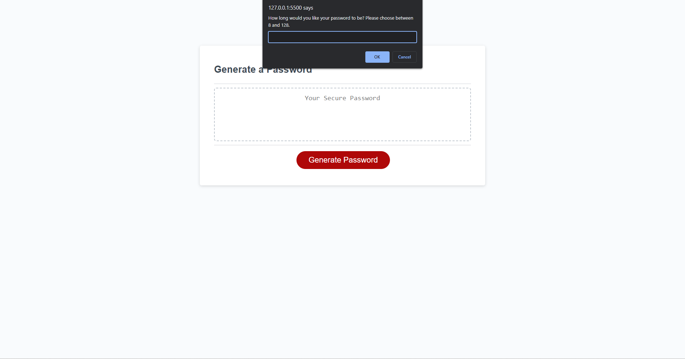
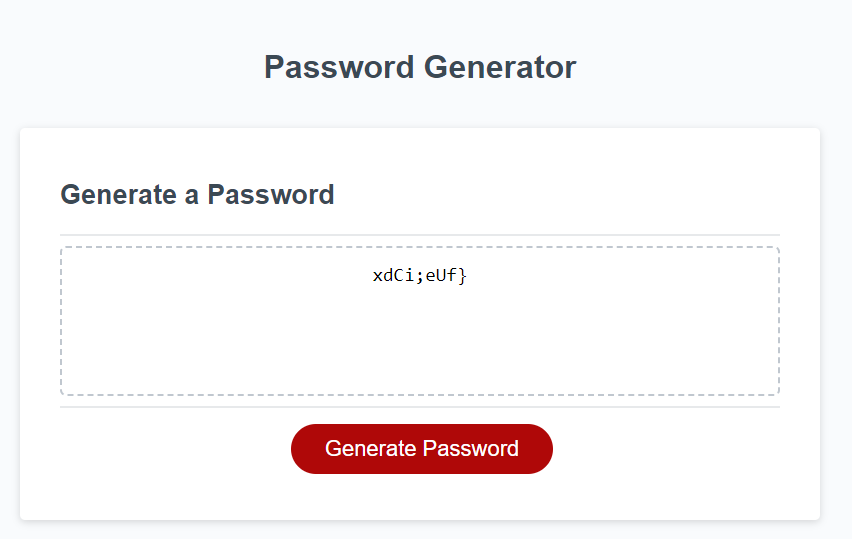

# <JavaScript-Password-Generator>

## Description

The aim of the project was to add to the JavaScript code to make the program functional. Functional in this case meant various prompts and alerts appearing that you could interact with to eventually have a randomly generated password made for you. Through working on this project I was able to not only develop a deeper understand of JavaScript concepts but also much more confidence in my ability to research documentation to learn what I need to finish projects. Conditional statements and iteration is beginning to make more sense to me in how it can be applied to a wider array of issues.

## Screenshots

## Link

https://cbarnes0.github.io/JavaScript-Password-Generator/